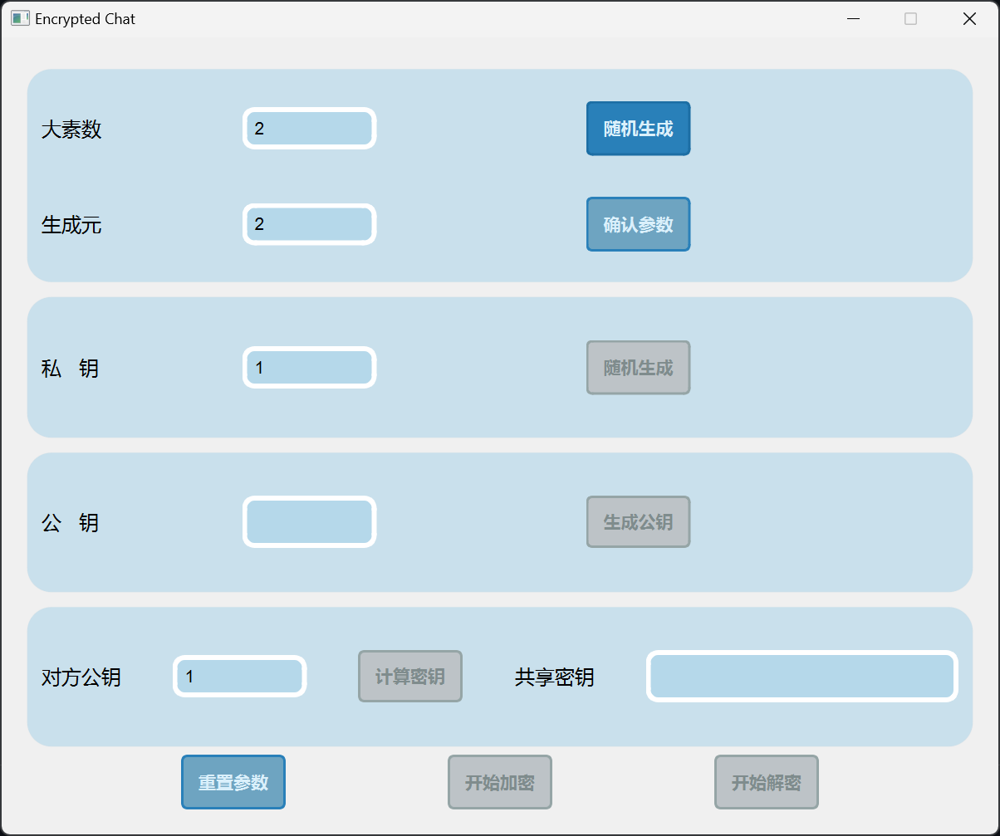
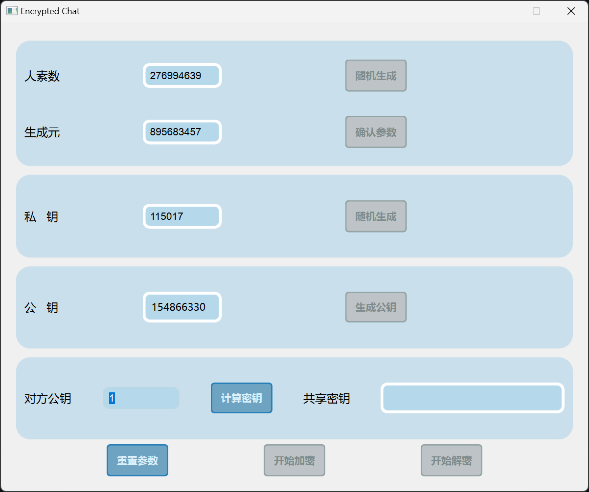
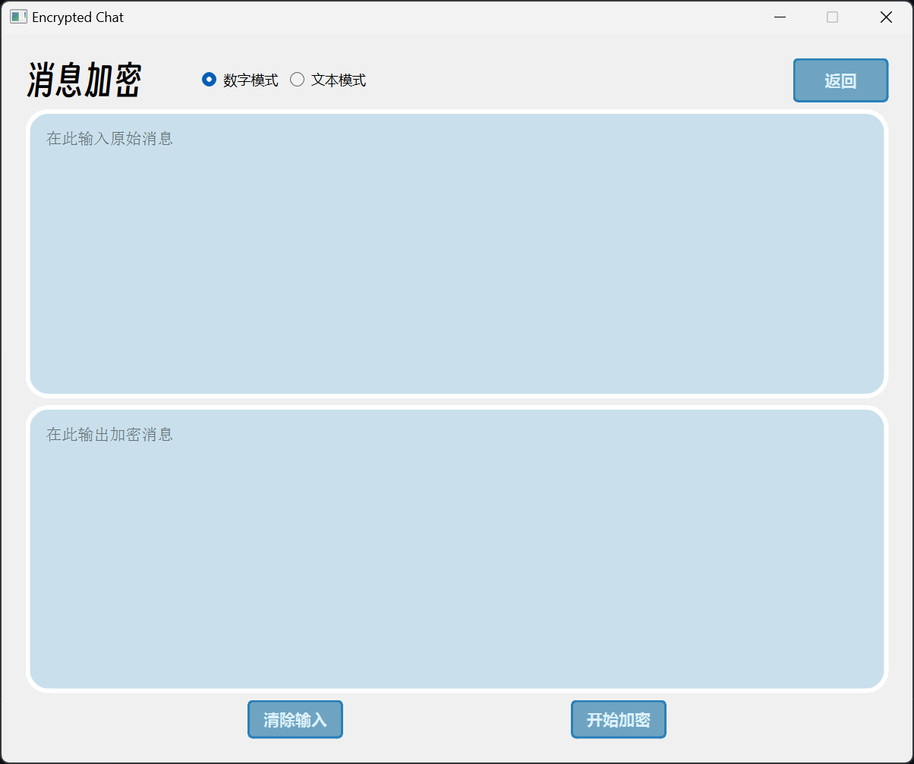
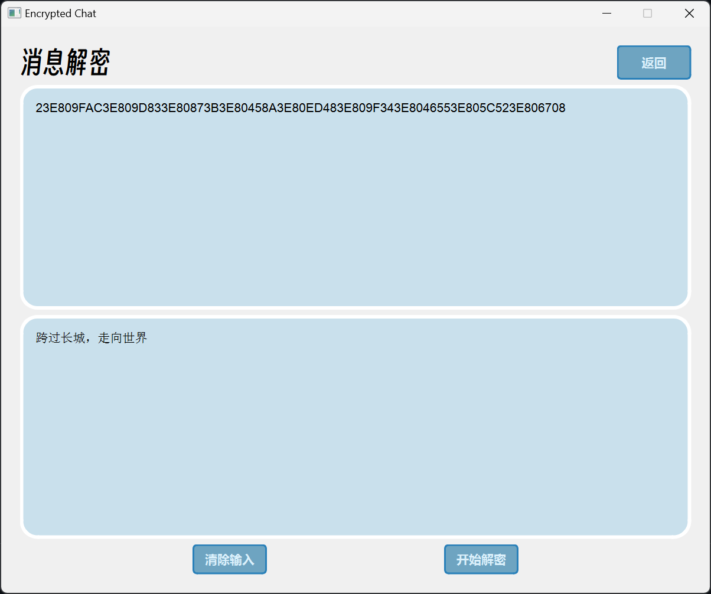

# DH Chat

A **SIMPLE LOW-TECH** Offline Encrypted Chat APP based on Diffie–Hellman (DH) key exchange  
一个基于DH密钥交换的简单的低技术离线加密聊天软件  
&emsp;  
使用C++编写，基于Qt工具箱。个人练习用低技术力作品（逃）  

## 原理与使用方法

### Diffie-Hellman 密钥交换协议

#### 1. 选择公共参数

A和B选择一个大的素数 $p$ 和一个生成元 $g$。这些参数可以公开传输，因此第三方C也能看到。

#### 2. 生成私钥

A选择一个私钥 $a$ （一个介于1到 $p−1$ 之间的随机数），B选择一个私钥 $b$ （一个介于1到 $p−1$ 之间的随机数）。

#### 3. 生成公钥

A计算其公钥 $A = g^a$ mod $p$ 并将其发送给B，B计算其公钥 $B = g^b$ mod $p$ 并将其发送给A。

#### 4. 计算共享密钥

A使用B的公钥 $B$ 计算共享密钥 $S_A = B^a$ mod $p$  
B使用A的公钥 $A$ 计算共享密钥 $S_B = A^b$ mod $p$  
易证， $S_A$ 和 $S_B$ 是相等的。则A和B双方得到了共享密钥 $S = S_A = S_B$  
&emsp;  
即使C监听了所有通信，包括公共参数和公钥，C仍然无法轻易计算出共享密钥 $S$，因为这涉及到离散对数问题，这是一个计算上非常困难的问题。  
  
这个算法保证了A和B可以在没有预先共享密钥的情况下安全地传递消息。

### 使用方法

  
点击随机生成可以生成新的公共参数 大素数 $p$ 和生成元 $g$，也可以手动输入后点击确认参数  

根据生成的公共参数，随机生成私钥 $a$，并点击生成公钥 $A$  
双方可以在网络上交换公钥 $A$ 和 $B$  
在系统中输入对方的公钥 $B$，点击计算生成共享密钥 $S$  

点击`开始加密`后进入加密消息界面  
在加密消息界面可以选择数字模式或文本模式。在输入框中输入消息，点击`开始加密`按钮即可得到加密后的消息。  

点击`开始解密`后进入加密解息界面  
在输入框中输入加密后的消息，点击`开始解密`按钮即可得到解密后的消息。  
